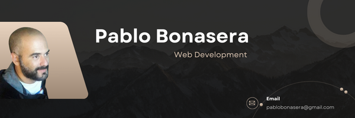

   
    

   
    

 Hello! I'm Pablo Bonasera, a Full Stack Developer with a strong passion for learning and attention to detail. I'm an entrepreneur at heart, always seeking to generate improvements based on the circumstances. I would love to be part of your team!

👯 Currently, I am actively learning and growing as a developer. I have been working as a Mentor at Microverse, collaborating with developers from around the world on a daily basis. This experience has not only enhanced my coding skills but also sharpened my communication and teamwork abilities. Starting in June 2021, I embarked on my coding journey by enrolling in various courses. Since then, I have made significant progress through dedication, overcoming challenges, and constantly striving for self-improvement. After successfully completing my Full Stack certification at Academlo Bootcamp, I joined Microverse to further expand my horizons.

Let's create something amazing together! Feel free to reach out.

  <h2 style="flex-grow: 1;   color: #0366d6;">  🚀 **Technologies I Work With** </h2>

- HTML/CSS
- JavaScript
- React
- Node.js
- Express.js
- MongoDB
- Git
- My Soft Skills
 

  <h2 style="flex-grow: 1; margin: 2rem 0; color: #0366d6;">  ⚡ **Detail-oriented** </h2>

- Strong problem-solving skills
- Excellent communication
- Team player
- Adaptable and quick learner
- Unique Selling Proposition (USP)
- As a Full Stack Developer, I bring a unique blend of technical skills and professional experience. With a background as a legal assistant, I have developed a strong work ethic, perseverance, and an analytical mindset. These skills, combined with my passion for continuous learning, enable me to tackle complex coding challenges effectively and efficiently.
 

  <h2 style="flex-grow: 1; margin: 2rem 0; color: #0366d6;">  💻 **Let's Connect!** </h2>

I'm excited to collaborate on projects that make a positive impact on the environment and society. If you're looking for a dedicated and adaptable developer to join your team, I would be thrilled to be considered. Let's connect and create a better, more sustainable future together!
   
    

 

Feel free to reach out to me via email at pablobonasera@gmail.com or connect with me on LinkedIn at [@PabloBona](https://www.linkedin.com/in/pablo-bonasera-142327257/)
